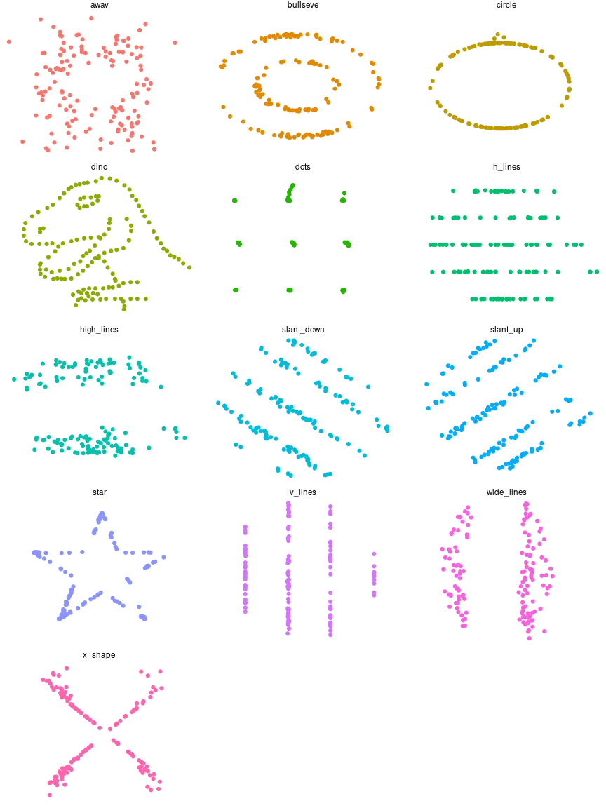

<!-- README.md is generated from README.Rmd. Please edit that file -->

# datasauRus

<!-- badges: start -->

[](https://cran.r-project.org/package=datasauRus)
[](http://cran.rstudio.com/web/packages/datasauRus/index.html)
[](https://github.com/jumpingrivers/datasauRus/actions)
[](http://www.repostatus.org/#active)
<!-- badges: end -->

This package wraps the awesome Datasaurus Dozen datasets. The Datasaurus
Dozen show us why visualisation is important – summary statistics can be
the same but distributions can be very different. In short, this package
gives a fun alternative to [Anscombe’s
Quartet](https://en.wikipedia.org/wiki/Anscombe%27s_quartet), available
in R as `anscombe`.

The original Datasaurus was created by Alberto Cairo in this great [blog
post](http://www.thefunctionalart.com/2016/08/download-datasaurus-never-trust-summary.html).

The other Dozen were generated using simulated annealing and the process
is described in the paper “Same Stats, Different Graphs: Generating
Datasets with Varied Appearance and Identical Statistics through
Simulated Annealing” by Justin Matejka and George Fitzmaurice ([open
access materials including manuscript and
code](https://www.autodeskresearch.com/publications/samestats),
[official paper](https://doi.org/10.1145/3025453.3025912)).

In the paper, Justin and George simulate a variety of datasets that the
same summary statistics to the Datasaurus but have very different
distributions.


## Install

The latest stable version is available on CRAN

``` r
install.packages("datasauRus")
#> Installing package into '/home/rhian/R/x86_64-pc-linux-gnu-library/4.1'
#> (as 'lib' is unspecified)
```

You can get the latest development version from GitHub, so use
{devtools} to install the package

``` r
devtools::install_github("jumpingrivers/datasauRus")
#> Using github PAT from envvar GITHUB_PAT
#> Downloading GitHub repo jumpingrivers/datasauRus@HEAD
#>      checking for file ‘/tmp/RtmpgvFswg/remotes2243740b91509/jumpingrivers-datasauRus-1db1933/DESCRIPTION’ ...  ✓  checking for file ‘/tmp/RtmpgvFswg/remotes2243740b91509/jumpingrivers-datasauRus-1db1933/DESCRIPTION’
#>   ─  preparing ‘datasauRus’:
#>      checking DESCRIPTION meta-information ...  ✓  checking DESCRIPTION meta-information
#>   ─  checking for LF line-endings in source and make files and shell scripts
#>   ─  checking for empty or unneeded directories
#>   ─  building ‘datasauRus_0.1.4.tar.gz’
#>      
#> 
#> Installing package into '/home/rhian/R/x86_64-pc-linux-gnu-library/4.1'
#> (as 'lib' is unspecified)
```

## Usage

You can use the package to produce Anscombe plots and more.

``` r
library("ggplot2")
library("datasauRus")
ggplot(datasaurus_dozen, aes(x = x, y = y, colour = dataset))+
  geom_point() +
  theme_void() +
  theme(legend.position = "none")+
  facet_wrap(~dataset, ncol = 3)
```

<!-- -->

## Contributing to the package

Want to report a bug or suggest a feature? Great stuff! For more
information on how to contribute check out [our contributing
guide](.github/CONTRIBUTING.md).

Please note that this R package is released with a [Contributor Code of
Conduct](CODE_OF_CONDUCT.md). By participating in this package project
you agree to abide by its terms.
