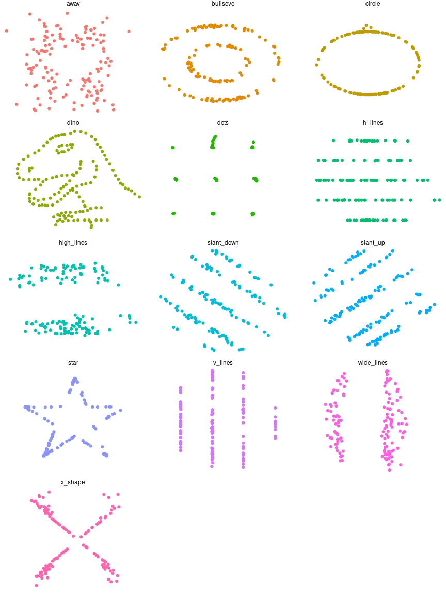

<!-- README.md is generated from README.Rmd. Please edit that file -->

# datasauRus 

<!-- badges: start -->

[](https://lifecycle.r-lib.org/articles/stages.html#stable)
[](https://CRAN.R-project.org/package=datasauRus)
[](https://github.com/jumpingrivers/datasauRus/actions)
<!-- badges: end -->

This package wraps the awesome Datasaurus Dozen datasets. The Datasaurus
Dozen show us why visualisation is important – summary statistics can be
the same but distributions can be very different. In short, this package
gives a fun alternative to [Anscombe’s
Quartet](https://en.wikipedia.org/wiki/Anscombe%27s_quartet), available
in R as `anscombe`.

The original Datasaurus was created by Alberto Cairo. The other Dozen
were generated using simulated annealing and the process is described in
the paper “Same Stats, Different Graphs: Generating Datasets with Varied
Appearance and Identical Statistics through Simulated Annealing” by
Justin Matejka and George Fitzmaurice ([open access materials including
manuscript and
code](https://www.research.autodesk.com/publications/same-stats-different-graphs/),
[official paper](https://doi.org/10.1145/3025453.3025912)).

In the paper, Justin and George simulate a variety of datasets that the
same summary statistics to the Datasaurus but have very different
distributions.


## Install

The latest stable version is available on CRAN

``` r
install.packages("datasauRus")
```

You can get the latest development version from GitHub, so use
{devtools} to install the package

``` r
devtools::install_github("jumpingrivers/datasauRus")
```

## Usage

You can use the package to produce Anscombe plots and more.

``` r
library("ggplot2")
library("datasauRus")
ggplot(datasaurus_dozen, aes(x = x, y = y, colour = dataset))+
  geom_point() +
  theme_void() +
  theme(legend.position = "none")+
  facet_wrap(~dataset, ncol = 3)
```

<!-- -->

## Code of Conduct

Please note that the datasauRus project is released with a [Contributor
Code of
Conduct](https://jumpingrivers.github.io/datasauRus/CODE_OF_CONDUCT.html).
By contributing to this project, you agree to abide by its terms
